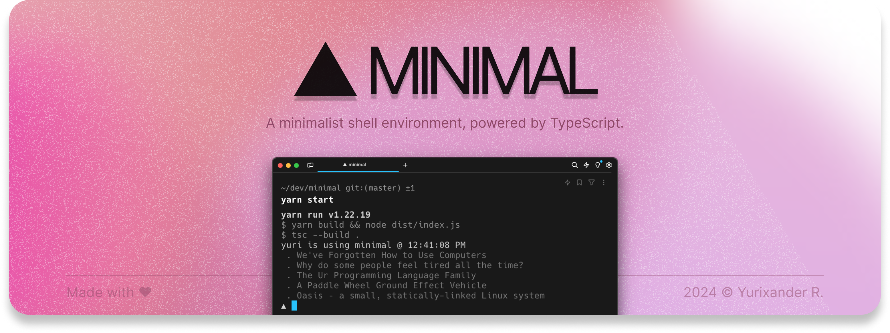

<div align="center">
  

  <p>🎯 <strong>Goal:</strong> Create an cross-platform, minimalistic shell environment powered by JavaScript, offering unique features and customization options.</p>
</div>

## Building and running

### Prerequisites

- [Node.js](https://nodejs.org/en)
- [Yarn](https://yarnpkg.com/)

### Building & running locally

```bash
yarn
yarn start
```

<hr />
<div align="center">
  <i>
    Please feel free to reach out to me on <a href="https://www.linkedin.com/in/yurixander/">LinkedIn</a> for business inquiries.<br />
    &copy; 2023 Yurixander Ricardo<br /><br />
    
  </i>
</div>